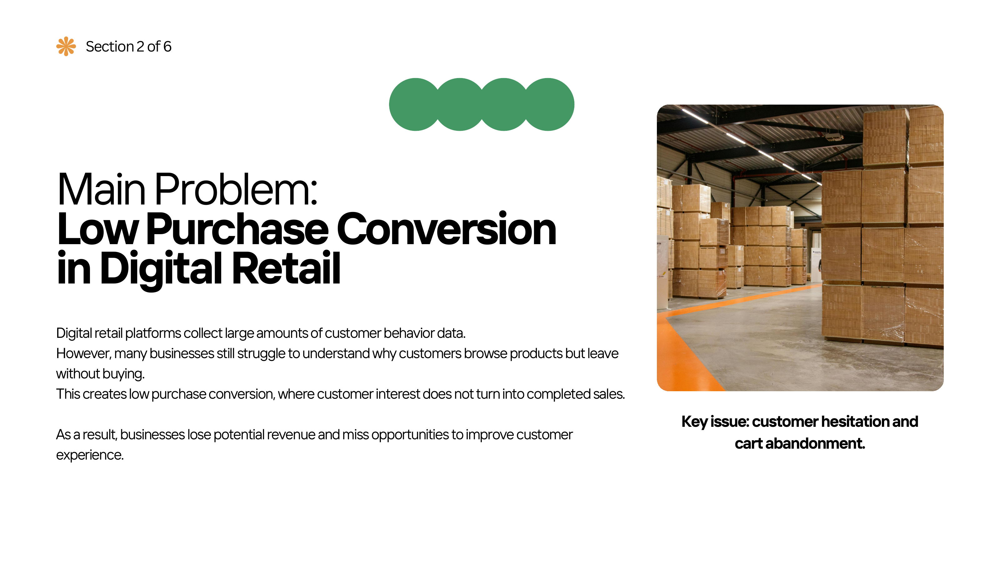
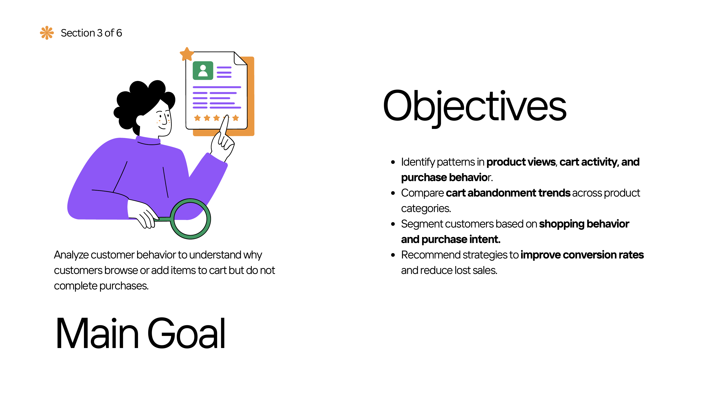
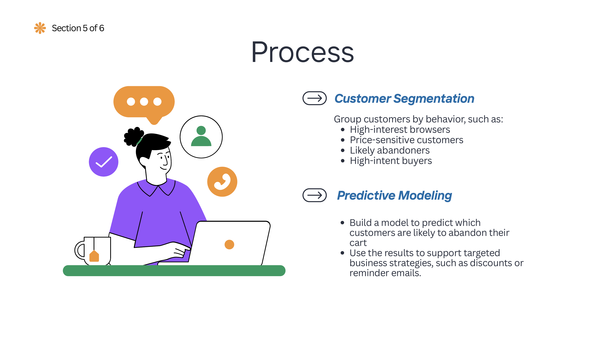

# Cart Abandonment Analytics - Project Proposal

## Digital Retail Customer Behavior Study

> Part 1 of a multi-stage cart abandonment analytics project.  
> Next stage: Exploratory Data Analysis and Customer Behavior Analysis.

This project proposal defines an analytics plan for understanding **low purchase conversion and cart abandonment in digital retail**.

The project was designed around a practical business problem: e-commerce platforms collect large amounts of customer behavior data, but businesses may still struggle to understand why customers browse products, add items to carts, and then leave without completing a purchase.

This stage focuses on **problem definition, project scope, planned data inputs, analytical workflow, customer segmentation, and predictive-modeling strategy**.

---

## Business Problem

The central problem is **low purchase conversion in digital retail**.

Customers may demonstrate interest through:

- Product views
- Page visits
- Cart additions
- Session activity

but still leave without buying.

This creates lost revenue and makes it difficult for businesses to distinguish between:

- Casual browsers
- High-interest visitors
- Price-sensitive customers
- Likely abandoners
- High-intent buyers

### Problem Statement



The project focuses specifically on **customer hesitation and cart abandonment** as a measurable business problem.

---

## Why Digital Retail?

Digital retail was selected because it provides rich customer-behavior data and clear business applications.

Potential behavioral signals include:

- Browsing patterns
- Product views
- Cart activity
- Pricing
- Purchase decisions
- Session timing
- Customer interaction sequences

Insights from this data can potentially support:

- Higher conversion rates
- Reduced lost sales
- Better marketing
- Improved product strategy
- Better customer experiences

---

## Project Goal

The main goal is to:

> **Analyze customer behavior to understand why customers browse or add items to cart but do not complete purchases.**

### Project Objectives



The proposal defines four core objectives:

1. Identify patterns in product views, cart activity, and purchase behavior.
2. Compare cart-abandonment trends across product categories.
3. Segment customers based on shopping behavior and purchase intent.
4. Recommend strategies to improve conversion rates and reduce lost sales.

---

## Proposed Data Sources

The initial project plan considered datasets from sources such as:

- Kaggle
- Hugging Face
- UCI Machine Learning Repository

The goal was to combine behavioral, product, session, and purchase data where possible.

---

## Proposed Inputs

The project was designed around three broad data categories.

### Customer Behavior Data

Examples:

- Product views
- Page visits
- Cart additions
- Purchase events

### Product Information

Examples:

- Price
- Category
- Availability

### Customer Session Data

Examples:

- User activity
- Timing
- Sequence of actions
- Conversion flow

---

## Planned Analytical Process

The planned workflow included several stages.

### 1. Data Preparation

- Clean customer-behavior data
- Remove missing or duplicate records
- Resolve inconsistent values
- Prepare data for analysis

### 2. Customer Journey Mapping

Track how customers move through:

```text
Browsing -> Cart -> Purchase / Abandonment
```

The goal is to identify where customers drop off before completing a purchase.

### 3. Cart Abandonment Analysis

- Compare abandonment behavior across categories
- Identify high-hesitation areas
- Measure customer drop-off
- Explore behavior associated with completed and abandoned purchases

### 4. Customer Segmentation

Proposed behavioral segments included:

- High-interest browsers
- Price-sensitive customers
- Likely abandoners
- High-intent buyers

### 5. Predictive Modeling



The proposal planned to build a model capable of identifying customers or sessions with a higher likelihood of abandonment.

The model output could then support targeted business actions such as:

- Reminder emails
- Discounts
- Retargeting
- Personalized recommendations

---

## Planned Outputs

The proposed analysis was expected to produce several types of business insights.

### Customer Behavior Insights

- Understand how users interact with products
- Identify browsing and purchase patterns
- Compare different types of sessions

### Cart Abandonment Findings

- Identify categories with higher abandonment
- Locate customer drop-off points
- Understand potential hesitation patterns

### Customer Segments

Potential segments included:

- High-hesitation customers
- Price-sensitive customers
- Frequent browsers
- High-intent buyers

### Business Recommendations

Potential actions included:

- Discount offers
- Reminder emails
- Free-shipping incentives
- Better product information
- Personalized recommendations
- Inventory and retail-strategy support

---

## Project Development Plan

The proposal outlined a **6-week analytics project** covering research, dataset preparation, data analysis, and presentation.

This repository represents the **planning and project-design stage**, before the later EDA and machine-learning stages were completed.

---

## Skills Demonstrated

### Business Analysis

- Problem definition
- Business-value identification
- KPI planning
- Conversion and customer-journey thinking

### Data Analytics Planning

- Input-process-output design
- Data-source evaluation
- Analytical workflow development
- KPI and output definition

### Customer Analytics

- Customer journey mapping
- Behavioral segmentation
- Purchase-intent analysis
- Cart-abandonment analysis

### Machine Learning Planning

- Predictive-modeling strategy
- Target-variable thinking
- Behavioral feature planning
- Model-to-business-action design

---

## Repository Contents

- `project_proposal_presentation.pdf` - Original project proposal presentation
- `images/problem_statement.png` - Main business problem
- `images/project_objectives.png` - Project goal and objectives
- `images/modeling_plan.png` - Customer segmentation and predictive-modeling plan

---

## Project Stage

**Stage 1 - Business Problem Definition & Analytics Planning**

This repository documents the initial design of the cart-abandonment analytics project. Later stages expanded the work into preprocessing, exploratory data analysis, customer-value analysis, and predictive modeling.
